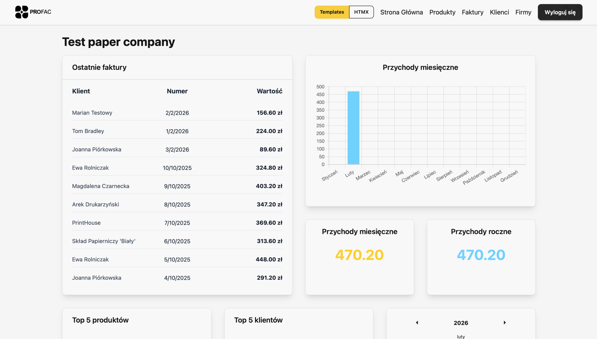
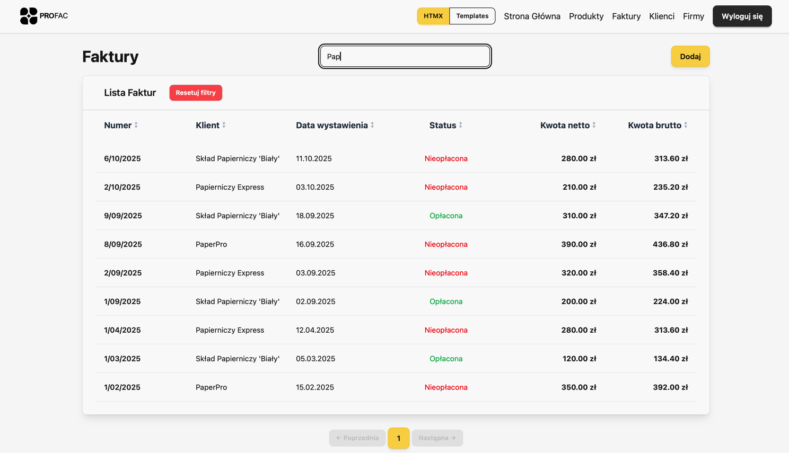
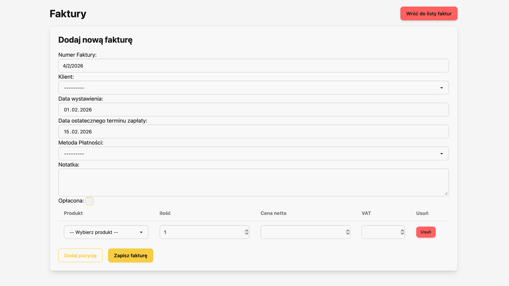

# Web Stack Comparison – Invoicing Application

This repository contains a comparison of two approaches to building a simple invoicing web application. The project was created as part of a master's thesis analyzing performance, developer experience, and user satisfaction across different technology stacks.
Focusing on Django as the full-stack framework and adding HTMX for frontend interactivity, the project contrasts traditional server-side rendering with modern client-side rendering techniques.


---
## Compared Stacks

1. **Django (SSR)**  
   Classic server-side rendering approach using Django templates.

2. **Django + HTMX (Progressive Enhancement)**  
   A hybrid method that enhances server-side rendering with partial HTML updates over AJAX using HTMX.


---
## How to run
1. Clone the repository and create a `.env` file
2. Copy .env.example to .env or set your own environment variables
3. Build containers and start the application using Docker Compose:
   ```bash
   docker-compose up --build
   ```
4. Access the application at `http://localhost:8000/templates/login/`
5. To log into a test account use:<br>
_testuser@test.com<br>
testuser_
6. Pick "Test paper company" to see sample invoices
___
## Example Screenshots



---
# About the Thesis

The goal of this project is to determine which stack offers the best trade-off between development time, performance, maintainability, and user experience for small-scale business applications like invoicing tools.

Results were evaluated using:

Development time tracking \
Google Lighthouse performance audits \
End-user testing and surveys \
Codebase maintainability assessment

---
## Python and Django Versions

This project was developed and tested using the following environments:

| Framework     | Version           |
|---------------|-------------------|
| Django        | 5.2 (LTS)         |
| Python        | 3.12 or 3.13      |

### Requirements

- **Docker** is used to containerize the application, ensuring consistent environments across different setups. This project requires Docker and Docker Compose to run.

### Version Details

- **Django 5.2** is a Long-Term Support (LTS) release that ensures stability and modern features.
- **Python 3.12** provides full compatibility with Django 5.2 and offers strong performance.
- **Python 3.13** is also supported by Django 5.2 but may require a newer environment and may include experimental features (e.g., JIT compiler).
- **HTMX 2.0** is compatible with both Python versions as it operates on the frontend.

**Recommendation**: Use **Python 3.12** for maximum stability. Use **Python 3.13** if you want to explore the latest language features.

---
# License

This project is part of an academic thesis. Feel free to use it for educational purposes.
